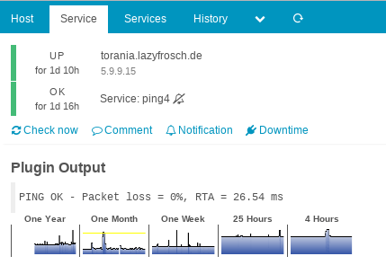
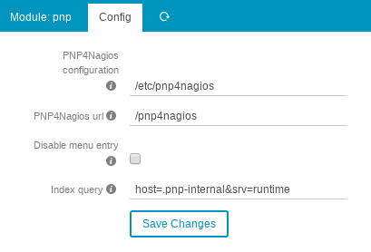

# PNP module for Icinga Web 2

#### Table of Contents

1. [About](#about)
2. [License](#license)
3. [Support](#support)
4. [Requirements](#requirements)
5. [Installation](#installation)
6. [Configuration](#configuration)
7. [FAQ](#faq)
8. [Thanks](#thanks)
9. [Contributing](#contributing)

## About

This module integrates [PNP](https://docs.pnp4nagios.org/) into [Icinga Web 2](https://www.icinga.com/products/icinga-web-2/)
and allows you to view beautiful graphs in the host/service detail view.

[](doc/screenshot/detail_view.png)
[](doc/screenshot/iframe.png)

## License

Icinga Web 2 and this Icinga Web 2 module are licensed under the terms of the GNU General Public License Version 2, you will find a copy of this license in the LICENSE file included in the source package.

## Support

Join the [Icinga community channels](https://www.icinga.com/community/get-involved/) for questions.

## Requirements

This module glues PNP and Icinga Web 2 together. Both of them are required
to be installed and configured:

* [Icinga Web 2](https://www.icinga.com/products/icinga-web-2/) (>= 2.4.1)
* [PNP](https://docs.pnp4nagios.org/) (&gt;= 0.6.25)


## Installation

Extract this module to your Icinga Web 2 modules directory as `pnp` directory.

Git clone:

```
cd /usr/share/icingaweb2/modules
git clone https://github.com/Icinga/icingaweb2-module-pnp.git pnp
```


Tarball download (latest [release](https://github.com/Icinga/icingaweb2-module-pnp/releases/latest)):

```
cd /usr/share/icingaweb2/modules
wget https://github.com/Icinga/icingaweb2-module-pnp/archive/v1.1.0.zip
unzip v1.1.0.zip
mv icingaweb2-module-pnp-1.1.0 pnp
```

### Enable Icinga Web 2 module

Enable the module in the Icinga Web 2 frontend in `Configuration -> Modules -> pnp -> enable`.
You can also enable the module by using the `icingacli` command:

```
icingacli module enable pnp
```

## Configuration

### PNP Configuration

The base URL for PNP (e.g. `/pnp4nagios`) must be accessible on the webserver.

There is an [open issue](https://github.com/Icinga/icingaweb2-module-pnp/issues/29)
for forwarding the Icinga Web 2 auth session to PNP.

### Module Configuration

Navigate to `Modules - PNP - Config` and specify the settings.

[](doc/screenshot/config_form.png)

## FAQ

### Duplicated Graphs in Detail View

There is a problem with `config.php` and `config_local.php`
in PNP (discussion [here](https://monitoring-portal.org/index.php?thread/35865-doppelte-eintr%C3%A4ge-im-icinga2-mit-pnp/&postID=228011#post228011)).

Remove the duplicated views in one of them, e.g. in `config_local.php`:

```
- $views[] = array('title' => '4 Hours',   'start' => (60*60*4) ); 
- $views[] = array('title' => '25 Hours',  'start' => (60*60*25) ); 
- $views[] = array('title' => 'One Week',  'start' => (60*60*25*7) ); 
- $views[] = array('title' => 'One Month', 'start' => (60*60*24*32) ); 
- $views[] = array('title' => 'One Year',  'start' => (60*60*24*380) );
```

The related issue can be found [here](https://github.com/Icinga/icingaweb2-module-pnp/issues/18).

### Preview Graphs Missing in Detail View

First off, the module needs to read the local PNP configuration files and as such
you need to ensure that the path can be read by the web server user. SELinux may prevent
this too next to wrong permissions or wrong paths. This path defaults to
`/etc/pnp4nagios` and requires adjustments for your own needs.
If the module is not able to read the configuration, an error will be logged
to the debug log and no graph will be rendered.

Also ensure that the user who is not seeing the graphs actually has the permission
to view the PNP module. Navigate into your roles configuration and verify that.

PNP stores meta information in an XML file next to the actual RRD file. If this file
is missing in your RRD data store, the module won't render graphs. Verify that PNP and
NPCD are running and troubleshoot why metrics are not updated. The debug level helps here.

Last but not least, if there are no graphs available, the detail view won't show any graphs.
You can verify that by opening the native PNP interface and search for the corresponding host
or service.

## Thanks


## Contributing

There are many ways to contribute to the Icinga Web module for PNP --
whether it be sending patches, testing, reporting bugs, or reviewing and
updating the documentation. Every contribution is appreciated!


